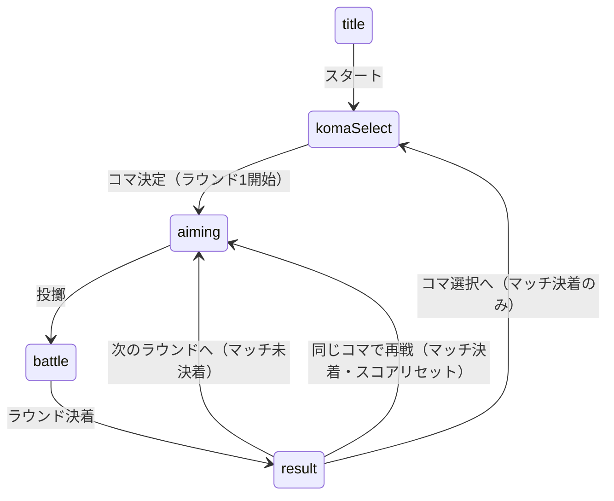

# 設計書

## アーキテクチャ概要

既存のレイヤードアーキテクチャ（UI → ゲームロジック → エンジン）を維持し、
ラウンド管理は **ゲームロジックレイヤーの `MatchStateMachine` 内部**に持たせる。
architecture.md の布石「`result → aiming` 遷移にラウンドカウンタを足す」に従い、
新しい `MatchPhase` は追加しない（画面の出し分けは状態機械の問い合わせで行う）。



## コンポーネント設計

### 1. MatchStateMachine（拡張・src/game/MatchStateMachine.ts）

**責務**:

- 既存のフェーズ遷移管理に加え、ラウンドスコア・ラウンド番号の管理
- マッチ決着（2勝先取）の判定と、決着状態に応じた遷移の許可/禁止

**追加する状態・API**:

```
ROUNDS_TO_WIN = 2                       // 勝利に必要な勝ち星（named export 定数）
roundNumber: number                     // 現在ラウンド（1 始まり。引き分けやり直しでは進めない）
score: { player: number; cpu: number }  // 勝ち星
matchOutcome: MatchOutcome | null       // マッチ全体の決着。未決着なら null
nextRound(): void                       // result → aiming（マッチ未決着時のみ許可）
```

**既存 API の変更**:

- `settle(verdict)`: ラウンド決着として勝ち星を加算（draw は加算なし）。
  加算後に 2 勝到達なら `matchOutcome` を確定する
- `rematch()`: **マッチ決着時のみ許可**に変更。スコア・ラウンド番号・matchOutcome を初期化
- `backToSelect()`: **マッチ決着時のみ許可**に変更。全状態を初期化
- `reset()`（エラー復帰用）: ラウンド状態も初期化

**実装の要点**:

- 引き分けラウンドは `roundNumber` を進めない（「ラウンド2をやり直し」と表示が自然）
- 不正遷移は既存どおり `InvalidTransitionError`
- 純粋性維持: DOM / three / rapier を import しない

### 2. ResultScreen（拡張・src/ui/ResultScreen.ts）

**責務**:

- マッチ未決着時: ラウンド結果・スコア・「次のラウンドへ」ボタン
- マッチ決着時: 最終勝敗・スコア・「同じコマで再戦」「コマ選択へ」ボタン

**実装の要点**:

- 出し分けは `matchOutcome === null` かどうかで判定（UI に判定ロジックを持たせない）
- 文言は `textContent` で構築（innerHTML 禁止）

### 3. main.ts（配線変更）

**責務**:

- ResultScreen の「次のラウンドへ」イベントを `nextRound()` に接続
- ラウンド開始時の物理ワールド再初期化（既存の rematch と同じ経路を再利用）

## データフロー

### ラウンド制の1マッチ

```
1. komaSelect でコマ決定 → ラウンド1・スコア 0-0 で aiming へ
2. battle 決着 → settle(verdict): 勝ち星加算・マッチ決着判定 → result へ
3a. マッチ未決着 → 「次のラウンドへ」 → nextRound() → aiming（コマ・スコア維持）
3b. マッチ決着 → 「同じコマで再戦」 → rematch() → スコアリセットして aiming
                → 「コマ選択へ」 → backToSelect() → 全リセットして komaSelect
```

## エラーハンドリング戦略

- 既存の `InvalidTransitionError` を踏襲。マッチ決着状態と矛盾する遷移
  （未決着での rematch、決着後の nextRound 等）はすべてこれを投げる
- 新規エラークラスは追加しない

## テスト戦略

### ユニットテスト（tests/unit/game/MatchStateMachine.test.ts に追加）

- 2-0 / 2-1 でのマッチ決着、matchOutcome の値
- 引き分けラウンド: スコア不変・roundNumber 不変・nextRound 可能
- 不正遷移: 未決着 rematch / backToSelect、決着後 nextRound
- rematch 後の初期化（スコア・ラウンド番号・selectedKoma 維持）
- reset() でラウンド状態が初期化される

### 統合テスト

- 既存 settle.test.ts はラウンド1の決着として成立するため原則変更なし
  （state machine の使い方が変わる箇所のみ追随）

## 依存ライブラリ

追加なし。

## ディレクトリ構造

```
src/game/MatchStateMachine.ts        # 拡張（ラウンド状態・nextRound）
src/types/match.ts                   # RoundScore 型を追加（必要なら）
src/ui/ResultScreen.ts               # 出し分け・スコア表示
src/main.ts                          # nextRound の配線
tests/unit/game/MatchStateMachine.test.ts  # ラウンド遷移のテスト追加
docs/baseline/functional-design.md   # 画面遷移図・データモデル・区分値の改訂
```

## 実装の順序

1. **前提確認**: battle-tuning（別セッション）のコミット完了を確認してから
   feature ブランチ（`feature/round-system`）を切る。
   未コミットの他作業の変更を巻き込まない
2. MatchStateMachine のラウンド拡張＋ユニットテスト（Red → Green）
3. ResultScreen の出し分け・スコア表示
4. main.ts の配線・動作確認
5. functional-design.md の改訂（画面遷移図・Match データモデル・UC-03 の更新）
6. 品質ゲート → 振り返り → セキュリティレビュー → コミット・PR

## セキュリティ考慮事項

- ユーザー入力の追加なし。表示は textContent のみで構築（XSS 回避）
- 外部通信・永続化の追加なし

## パフォーマンス考慮事項

- ラウンド間の物理ワールド再初期化は既存 rematch と同一経路のため追加コストなし

## 将来の拡張性

- `ROUNDS_TO_WIN` を定数化するため、5本勝負（3勝先取）は定数変更のみで対応可能
- ローカル対戦（P1）導入時も、ラウンド管理は ThrowProvider に依存しないため無改修で流用できる
