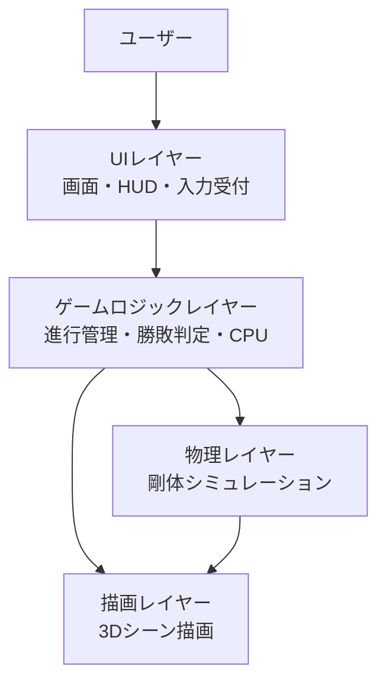
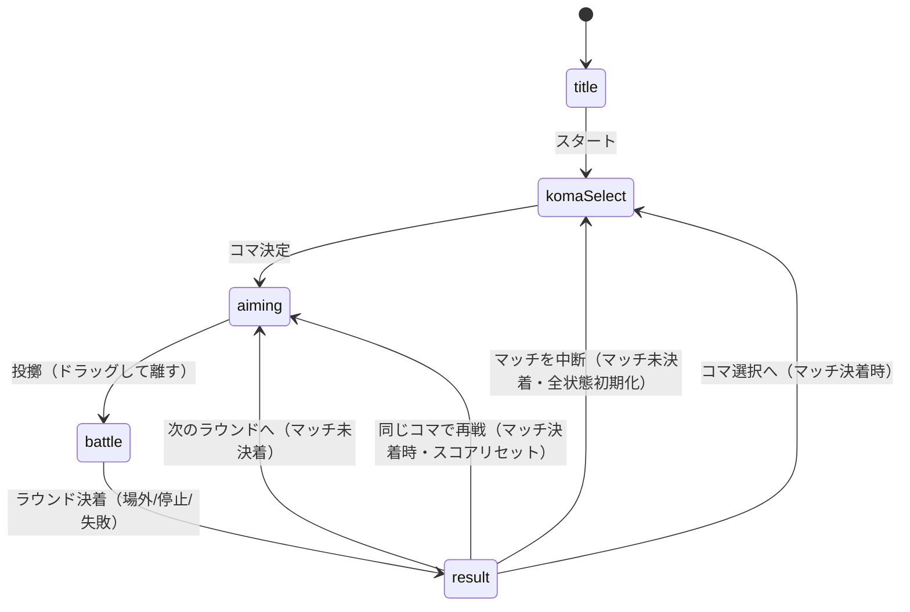
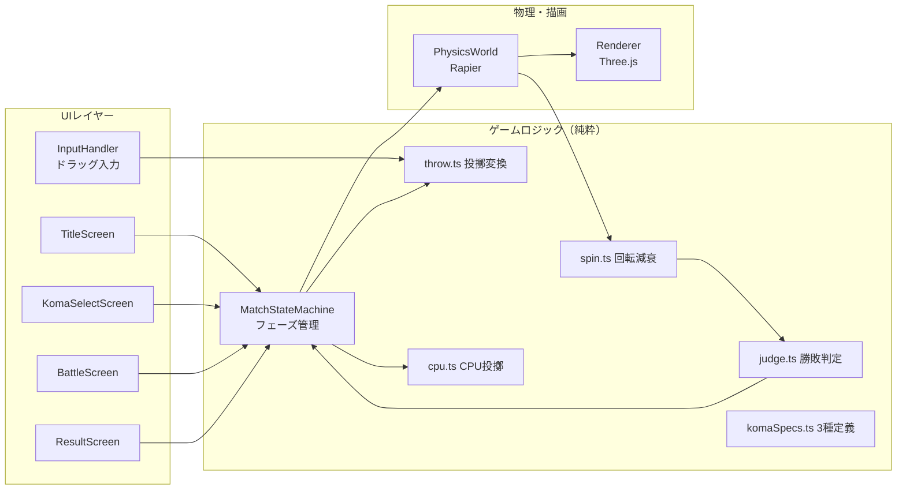

# 機能設計書 (Functional Design Document)

作成日: 2026-08-19
工程: 基本設計 — **どう実現するかの正本**
正本参照: 要件は [`product-requirements.md`](./product-requirements.md)、技術選定の根拠は [`architecture.md`](./architecture.md)

> 本プロジェクトは**クライアント完結型のブラウザゲーム**であり、バックエンド・データベース・
> 外部 API を持たない。そのため本書の「API一覧」「データモデル」はテンプレートの
> サーバーアプリ前提から読み替えて、ゲーム内の概念モデル・画面状態遷移を正本として扱う。

## システム構成図



- 依存の向きは **UI → ゲームロジック → 物理/描画** の一方向。逆流させない
- 勝敗判定・ステータス計算・投擲変換などの**中核ロジックは物理・描画に依存しない純粋関数**として
  ゲームロジックレイヤーに置く（テスト対象の主眼）
- 詳細な責務・許可/禁止は `architecture.md`「アーキテクチャパターン」を正本とする

## 技術スタック

| 分類 | 技術 | 選定理由 |
|------|------|----------|
| 言語 | TypeScript | 型による設計の明文化。エコシステムが最大 |
| ビルド | Vite | 開発サーバーが高速。静的ビルドで配布要件（静的ホスティング）に合致 |
| 3D描画 | Three.js | WebGL の事実上の標準。情報量・実績が最多 |
| 物理エンジン | Rapier (@dimforge/rapier3d-compat) | WASM製で高速・決定的。回転体の剛体シミュレーションに十分な精度 |
| UI | HTML/CSS オーバーレイ（フレームワークなし） | 画面数が少なく状態機械で足りる。React 等は過剰 |
| テスト | Vitest | Vite と同一エコシステム。純粋ロジックの単体テストに使う |
| ホスティング | 静的ホスティング（GitHub Pages 想定） | サーバー不要の要件に合致。無償で運用できる |

> 技術選定の詳細な根拠・比較は `docs/baseline/architecture.md` を正本とする。

## データモデル

> DB は存在しない。ここでは**ゲーム内の概念モデル**（エンティティ・区分値・制約）を定義する。
> すべてメモリ上の状態であり、永続化は行わない（PRD スコープ外: セーブデータ）。

### エンティティと区分値

- エンティティ: **コマ種別（KomaSpec）** / **コマ実体（Koma）** / **対戦（Match）**。
  関係: コマ種別 1 ―― * コマ実体、対戦 1 ―― 2 コマ実体（プレイヤー側・CPU側）。
- 区分値:
  - `KomaTypeId` = `heavy`（重量型） | `speed`（速攻型） | `balance`（バランス型）
  - `MatchPhase` = `title` | `komaSelect` | `aiming`（投擲操作中） | `battle`（自動戦闘） | `result`
  - `MatchOutcome` = `playerWin` | `cpuWin` | `draw`
  - `WinReason` = `ringOut`（場外） | `spinStop`（回転停止） | `foul`（投げ込み失敗＝場外着地）

### エンティティの属性（概念レベル）

- **コマ種別（KomaSpec）**: 種別ID・表示名・重さ・初期回転力・回転減衰率・攻撃補正・説明文。
  固定3種を静的定義として持つ（外部データ化しない）
- **コマ実体（Koma）**: 参照するコマ種別・現在の回転速度・位置・速度・場内/場外フラグ
- **対戦（Match）**: フェーズ・プレイヤーのコマ・CPUのコマ・経過時間・
  ラウンドスコア（プレイヤー/CPU の勝ち星）・直近ラウンドの結果（成立時のみ）・
  マッチ結果（2勝先取の成立時のみ）

### ドメイン上の制約

- コマの回転速度は 0 以上。0 になった時点で「停止」となり、以後復帰しない
- 場外判定は一度成立したら覆らない（床に戻っても場外のまま）
- 双方が同一フレームで敗北条件を満たした場合は `draw` とする
- 投擲操作のドラッグ量は最小・最大でクランプし、必ず有効な投擲になる範囲に正規化する
- 対戦は**3本勝負（2勝先取）のラウンド制**とする。引き分けラウンドはどちらの勝ち星にも
  ならず、同ラウンドをやり直す（ラウンド番号は進めない）。コマ選択はマッチ開始時の1回のみ。
  勝利に必要な勝ち星数の正本は `src/game/MatchStateMachine.ts` の `ROUNDS_TO_WIN`

### 確定事項（概念レベル）

- 床（トコ）は**中央が窪んだ円形の椀状**とし、コマは自然に中央へ集まる（実物の樽トコを模す）
- 物理は**固定タイムステップ（60Hz）**で更新し、描画フレームレートと分離する
- 乱数は CPU の投擲ゆらぎのみに使用し、シード注入可能にする（テスト容易性のため）
- 永続化・通信は一切行わない（計測を入れる場合も architecture.md に明記してから）

## アルゴリズム設計（ドメインロジック）

> 中核ロジック。すべて物理・描画に依存しない純粋関数として `src/game/` 配下に実装する。

### アルゴリズム: 投擲変換（ドラッグ入力 → 初期状態）

**目的**: ドラッグの方向・長さから、コマの投入位置・初速・初期回転速度を算出する

**計算ロジック**:
- ドラッグベクトル `d`（画面座標、開始点→離した点の逆向き＝引っ張り方向の逆が投擲方向）を取得
- 長さ `|d|` を `[dragMin, dragMax]` でクランプし、パワー `p = (|d| - dragMin) / (dragMax - dragMin)` を 0〜1 に正規化
- 初速 = `vMin + p * (vMax - vMin)`（水平方向、投擲方向）
- 初期回転速度 = コマ種別の初期回転力 × `(0.8 + 0.2 * p)`（強く投げるほど回転も強い）
- 投入位置は床の縁の自陣側固定点、投入高さは固定

**計算式（まとめ）**:
```
p    = clamp01((|d| - dragMin) / (dragMax - dragMin))
v0   = vMin + p * (vMax - vMin)
spin0 = spec.initialSpin * (0.8 + 0.2 * p)
```

**エッジケース（テスト対象)**:
- `|d| < dragMin`（ちょい引き）→ p=0 の最弱投擲になる（投擲不成立にはしない）
- `|d| > dragMax`（引きすぎ）→ p=1 でクランプ
- ドラッグ長 0（タップのみ）→ 投擲開始扱いにしない（aiming 継続）

**例**:
```
入力: |d| = dragMax, 方向 = 床中心向き, コマ = 速攻型
出力: p = 1.0, v0 = vMax, spin0 = 速攻型.initialSpin × 1.0
```

### アルゴリズム: 回転減衰と停止判定

**目的**: コマの回転速度を時間経過と衝突で減衰させ、停止（敗北条件）を判定する

**計算ロジック**:
- 毎物理ステップ: `spin ← spin × (1 - spec.decayRate * dt)`（自然減衰）
- 衝突時: 衝突相対速度に比例した減衰を追加。攻撃側（相対速度ベクトルの向きで判定）は
  自分の攻撃補正分だけ相手の減衰を増やす
- `spin < spinStopThreshold` になったら停止と判定し、以後 0 に固定

**計算式（まとめ）**:
```
自然減衰: spin' = spin * (1 - decayRate * dt)
衝突減衰: spin' = spin - max(最低チップ量, impactMag * 係数 * 相手の攻撃補正)
停止:     spin < spinStopThreshold → stopped = true
```

> 最低チップ量（IMPACT_MIN_DECAY）: かすった衝突でも体力（回転）が目に見えて減るための下限
> （2026-08-20 のプレイフィードバックで追加）。定数の具体値は `src/game/komaSpecs.ts` が正本。

**エッジケース（テスト対象）**:
- しきい値ちょうど（`spin == spinStopThreshold`）→ 停止しない（未満で停止）
- 1ステップで双方停止 → 引き分け判定へ
- 減衰率 0・攻撃補正 0 のパラメータでも発散しない
- 攻撃補正 0・衝突強度 0 でも、衝突と判定されれば最低チップ量は削れる

### アルゴリズム: 勢い負けノックバック

**目的**: 回転が弱った側が弾き飛ばされる、実物のベーゴマらしい「場外」決着を作る
（2026-08-20 のプレイフィードバックで追加。衝突イベント起点では接触したまま押し合う状況で
決着がつかないため、**接触距離**起点で判定する）

**計算ロジック**:
- 毎物理ステップ、両コマの水平距離と回転残量比（現在spin / 初期spin）を評価する
- 発動条件（すべて満たす場合のみ）:
  1. 距離 ≤ 接触距離（コマ直径 + 余裕）
  2. 劣勢側の残量比 < `WEAK_SPIN_RATIO`
  3. 残量比の差 ≥ `KNOCKBACK_MIN_GAP`
- 劣勢側に、相手から離れる方向へ追加速度 `KNOCKBACK_SPEED` を与える

**計算式（まとめ）**:
```
発動 = distance ≤ CONTACT_DIST かつ min(比p, 比c) < WEAK_RATIO かつ |比p − 比c| ≥ MIN_GAP
対象 = 残量比が低い側 / 追加速度 = KNOCKBACK_SPEED（相手→対象の方向）
```

**エッジケース（テスト対象）**:
- 接触していなければ発動しない
- 双方とも健在（残量比が WEAK_RATIO 以上）なら発動しない
- 互角（差が MIN_GAP 未満）なら発動しない → 同タイプ同士は回転停止で決着するのが正
- 定数は `src/game/komaSpecs.ts` を正本とする（ヘッドレス計測で 場外:停止 ≈ 5:5 に調整済み）

**例**:
```
入力: 距離 ≤ CONTACT_DIST（接触）, 残量比 プレイヤー 0.30 / CPU 0.45
出力: プレイヤーが CPU から離れる方向へ +KNOCKBACK_SPEED（トコの縁を越えうる速度）
※ 具体値は src/game/komaSpecs.ts が正本（ここに複製しない）
```

### アルゴリズム: 勝敗判定

**目的**: 場外・回転停止・投げ込み失敗から対戦の決着を判定する

**計算ロジック**:
- 毎物理ステップ後に両コマの状態を評価する
- **場外（ringOut）**: コマの位置が床円の半径 + マージンを超えた、または床面より一定以上落下した
- **投げ込み失敗（foul）**: 投擲後、床に一度も接地せず場外に出た場合（自滅）
- **停止（spinStop）**: 回転停止判定が成立した側の負け
- 優先順位: 同一ステップ内では 場外 > 停止。双方同時成立は `draw`

**計算式（まとめ）**:
```
ringOut = |xz位置| > tokoRadius + margin  or  y < floorY - fallMargin
決着    = 相手のみ敗北条件 → 勝ち / 双方 → draw / 自分のみ → 負け
```

**エッジケース（テスト対象）**:
- 場外に出た直後に床へ跳ね返って戻る → 場外判定は覆らない
- 双方同一ステップで場外 → draw
- プレイヤー投げ込み失敗 → CPU の勝ち（WinReason = foul）

### アルゴリズム: CPU 投擲

**目的**: CPU の投擲パラメータを決定し、対戦を成立させる

**計算ロジック**:
- 狙い: 床中心に向けた基準ベクトルに、シード付き乱数で角度ゆらぎ（±10°）・パワーゆらぎ（0.6〜0.9）を加える
- コマ選択: 3種からシード付き乱数で等確率に選ぶ
- 投擲タイミング: プレイヤーの投擲と同時（battle フェーズ開始時）

**エッジケース（テスト対象）**:
- 同一シードなら同一の投擲になる（再現性）
- ゆらぎ最大でも投げ込み失敗（自滅）しないパラメータ範囲であること

## API一覧

**該当なし。** 本プロダクトはクライアント完結であり、HTTP API・外部サービス呼び出しを持たない。
将来オンライン対戦（PRD: P2）を導入する場合に本節を起こす。

## 画面設計

### 画面一覧

> SPA だがルーターは使わず、単一ページ内の**フェーズ切替**（`MatchPhase`）で画面を構成する。
> 「ルート」列はフェーズ名を正本とする。

| 画面名 | フェーズ | 対応コンポーネント | 目的 | 主な要素 |
|---|---|---|---|---|
| タイトル | `title` | `TitleScreen` | ゲーム開始の入口 | タイトルロゴ・スタートボタン |
| コマ選択 | `komaSelect` | `KomaSelectScreen` | 3種からコマを選ぶ | コマ3種のカード（名前・ステータス表示）・決定ボタン |
| 投擲 | `aiming` | `BattleScreen`（HUD: 投擲ガイド） | ドラッグで投げ込む | 3Dシーン・ドラッグ軌道ガイド・パワー表示 |
| 対戦 | `battle` | `BattleScreen`（HUD: 回転ゲージ） | ぶつかり合いを見守る | 3Dシーン・両者の回転ゲージ |
| リザルト | `result` | `ResultScreen` | ラウンド/マッチの勝敗表示と次への導線 | 勝敗・決着理由・ラウンドスコア。マッチ未決着時は「次のラウンドへ」「マッチを中断してコマ選択へ」、決着時は「同じコマで再戦」「コマ選択へ」 |

### 画面遷移図



## ユースケース一覧

| ID | ユースケース | アクター | 目的 | 関連画面 |
|---|---|---|---|---|
| UC-01 | 対戦を1マッチ（3本勝負）完了する | プレイヤー | 投擲からマッチ決着までの中核体験 | タイトル→コマ選択→（投擲→対戦→リザルト）×ラウンド |
| UC-02 | コマを選んで戦い方を変える | プレイヤー | 種別ごとの個性で戦略を選ぶ | コマ選択 |
| UC-03 | 決着後すぐ再戦する | プレイヤー | テンポよく繰り返し遊ぶ | リザルト→投擲（次ラウンド/再戦） |
| UC-04 | WebGL 非対応環境で通知を受ける | プレイヤー | 遊べない理由を知る | タイトル（フォールバック表示） |

## モジュール構成図（画面 × ゲームロジック）



**読み方**:
- UI はフェーズ管理（MatchStateMachine）にだけイベントを送る。物理・描画を直接触らない
- 物理ステップの結果を回転減衰 → 勝敗判定に通し、決着したらフェーズ管理が `result` へ遷移する
- 各モジュールの物理配置は [リポジトリ構造定義書](repository-structure.md) を正本とする

---

フェーズ横断の実装詳細（UI表示仕様・エラーハンドリング・テスト戦略）は
[`docs/specs/_shared/cross-cutting.md`](../specs/_shared/cross-cutting.md) を参照。
